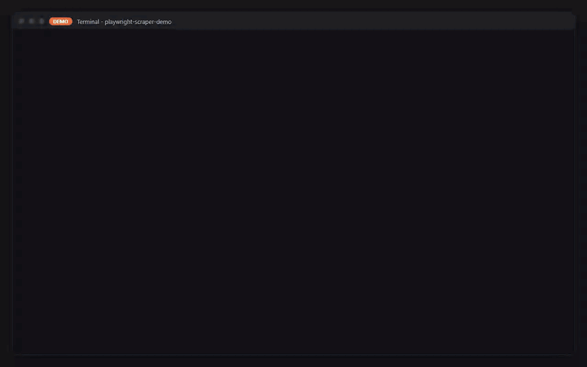

# Scraper web con Playwright → Excel + informe PDF

> **Proyecto DEMO de portafolio.** Los datos vienen de [books.toscrape.com](https://books.toscrape.com), un
> sitio público creado para practicar web scraping. Sus precios y calificaciones son aleatorios.



[English version](README.md) · [Video MP4](docs/demo.mp4)

*Solo dos partes del video están aceleradas y cada cuadro acelerado muestra su velocidad: el recorrido
(4× mientras cargan las páginas, 2× mientras se procesan) y la reproducción del log de la ejecución completa
(3×). La planilla que aparece es una vista previa HTML generada a partir del archivo `.xlsx`, no Excel.*

## Problema

Un minorista quiere revisar a diario el catálogo en línea de un competidor: qué productos ofrece, a qué precio,
qué calificación tienen y si hay stock. Hacerlo a mano toma horas y produce planillas poco confiables.

## Solución

Un solo comando recorre todo el catálogo con un navegador real, valida cada registro y entrega:

- **`books.xlsx`**: tablas de Excel con filtros; hojas Data, Summary (por categoría: cantidad, precio
  promedio/mediana/mínimo/máximo, calificación promedio), Opportunities (calificación ≥ 4 y precio por
  debajo de la mediana de su categoría) y Run Info
- **`books.csv`**: exportación plana
- **`report.pdf`**: portada con sello **DEMO** y fecha/hora, 8 indicadores, 2 gráficos y el top 10 de
  oportunidades
- **`run_log.json`**: páginas, reintentos, errores, registros inválidos y tiempos

**Ejecución real del catálogo completo** (25/09/2026 15:52 UTC, datos en `examples/output/`): **1000
productos, 50 categorías, 80 páginas, 0 errores, 0 registros inválidos, 28,6 s**. Precio promedio £35,07,
173 oportunidades. El tiempo depende sobre todo de la latencia de la red.

## Stack

Python 3.12 · Playwright 1.58 (async, Chromium) · pydantic · openpyxl · reportlab · matplotlib · pytest

## Cómo ejecutarlo

**Windows (PowerShell)**

```powershell
py -3.12 -m venv .venv
.\.venv\Scripts\Activate.ps1
pip install -r requirements.txt
python -m playwright install chromium
python -m scraper
```

**Linux / macOS**

```bash
python3.12 -m venv .venv && source .venv/bin/activate
pip install -r requirements.txt
python -m playwright install --with-deps chromium
python -m scraper
```

Opciones útiles: `--categories 5` o `--categories "Travel,Poetry"`, `--max-pages 1`, `--headed` (muestra el
navegador), `--out carpeta`, `--attempts 3` (primer intento + hasta 2 reintentos). Pruebas sin conexión a
internet (67): `pip install -r requirements-dev.txt` y luego `pytest`.

**Códigos de salida**: `0` éxito; `1` parcial (fallaron páginas o hubo registros inválidos); `2` falla
(argumentos inválidos, robots.txt inaccesible o que prohíbe el acceso, error del sitio o del navegador, sin
registros válidos, o un archivo de salida bloqueado, por ejemplo `books.xlsx` abierto en Excel). Los archivos
se generan en una carpeta temporal y se reemplazan todos juntos: si uno está bloqueado, no se reemplaza
ninguno y `run_log.json` registra `"status": "failed"` con el motivo.

## Ética y robots.txt

El 25/09/2026, `https://books.toscrape.com/robots.txt` respondió **HTTP 404**, lo que según el RFC 9309 significa
que no hay restricciones. Aun así, el scraper lee robots.txt al inicio y verifica cada URL, incluida la página
de inicio. Las reglas se aplican según el RFC 9309: el grupo se elige por el identificador de la herramienta
(`playwright-scraper-demo`, o `*` si no existe), gana la regla más específica y un `Crawl-delay` se respeta
entre todas las páginas en paralelo. Si robots.txt no responde (5xx, 429 o error de red), no rastrea. Además,
usa como máximo 4 páginas en paralelo, una pausa entre páginas y reintentos con espera exponencial, y se
identifica en el user agent. En proyectos reales, revise los términos del sitio, prefiera una API oficial si
existe y no recopile datos personales sin base legal.

Licencia [MIT](LICENSE) © João Vitor Sousa Leite
