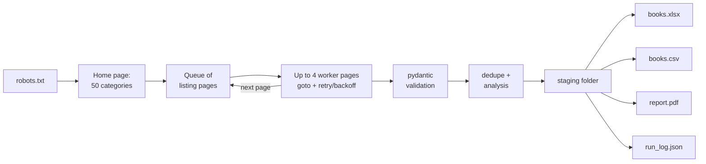

# Playwright Web Scraper → Excel + PDF report

> **DEMO / portfolio project.** Data comes from [books.toscrape.com](https://books.toscrape.com), a public sandbox
> built for scraping practice. Its prices and ratings are randomly assigned and mean nothing in the real world.


*About 20 seconds. Only two parts are sped up, and every sped-up frame carries a speed badge: the crawl
(4× while pages load, 2× while they are processed) and the replay of the full-run log (3×, also marked on
screen as a fast replay). Everything else plays at 1×. It shows a real headed crawl of 3 categories, the real
log of the full run, the generated PDF opened in Chromium (pdf.js) and an HTML preview of the generated
workbook, rendered from the `.xlsx` file. [MP4 version](docs/demo.mp4)*

[Leer en español](README.es.md)

---

## Problem

A retailer wants to watch a competitor's online catalog every day: what is listed, at what price, how each item
is rated and whether it is in stock. Doing that by hand means hours of copy-and-paste, missed pages and a
spreadsheet nobody trusts.

## Solution

One command crawls the whole catalog with a real browser, validates every record and delivers files a buyer or
manager can use right away:

- **`books.xlsx`**: formatted Excel tables with filters, a per-category summary and a list of price opportunities
- **`books.csv`**: flat export for BI tools or databases
- **`report.pdf`**: a 3-page report with KPIs, 2 charts and the top 10 opportunities
- **`run_log.json`**: what happened in the run (pages, retries, errors, invalid records, timings)

**Real run, full catalog** (numbers from [`examples/output/run_log.json`](examples/output/run_log.json),
collected 2026-09-25 16:26 UTC on Windows 11):

| Products | Categories | Listing pages | Failed pages | Invalid records | Crawl time |
|---:|---:|---:|---:|---:|---:|
| 1,000 | 50 | 80 | 0 | 0 | 23.6 s |

Average price £35.07, median £35.98, average rating 2.92 / 5, **173 opportunities** (rating ≥ 4 and priced
below the median of their own category). Crawl time depends mostly on network latency to the site, so it
changes from run to run.

## Stack

| Area | Tool |
|---|---|
| Language | Python 3.12 (venv) |
| Browser automation | Playwright 1.58 (async API, Chromium) |
| Validation | pydantic v2, one model per product |
| Excel | openpyxl (Excel tables, number formats, data bars, hyperlinks) |
| PDF / charts | reportlab + matplotlib |
| Tests | pytest, offline (saved HTML, Playwright routing and a localhost server; no internet) |

---

## Features

- **Full catalog with pagination**: discovers all 50 categories and follows every "next" link. A "next" link
  that points back to a page already queued ends the category instead of looping.
- **Bounded concurrency**: a pool of up to 4 browser pages (`--concurrency`, never more than the number of
  categories) pulls pages from a queue. Categories run in parallel, while pages within a category stay in
  order. The reports show how many browser pages were actually used.
- **Polite by default**: 0.5 s delay plus jitter after every page, per worker. In headless mode only the HTML
  of each page is downloaded: images, fonts, media, stylesheets and scripts are blocked, because the extraction
  reads the DOM only (measured on the live site: 1 request per listing page instead of 9). A robots.txt
  `Crawl-delay` is enforced by one limiter shared by all workers: at most one page load per Crawl-delay across
  all workers, whatever `--concurrency` is. In headless mode that page load is a single request.
- **robots.txt checked first**, then before every navigation, the home page included, matched on the tool's
  own product token (see [Ethics](#ethics-and-robotstxt)).
- **Retry with exponential backoff + jitter** on timeouts, 5xx and 429. A 404 (or any other 4xx) is not
  retried. `--attempts 3` means the first try plus up to 2 retries.
- **Validation before export**: every row goes through a pydantic model (price > 0, rating 1-5, valid URL,
  non-empty title). Invalid rows are left out of the exports, logged and listed in `run_log.json`. Prices with
  thousands separators (`£1,234.56`, `1.234,56 €`) are parsed correctly.
- **Deduplication** by product URL. A category named twice in `--categories` is crawled once.
- **Page limits stated in the output**: a run limited with `--max-pages` still ends as `success` (the limit was
  asked for), but the PDF, the Summary and Run Info sheets, `run_log.json` and the console all say so, and
  name the categories that had more pages than the run read.
- **Safe outputs for unattended runs**: the deliverables (`books.xlsx`, `books.csv`, `report.pdf`, `charts/`)
  are written to a staging folder and swapped in together. If one of the old deliverables cannot be replaced
  (for example `books.xlsx` open in Excel), none is: the previous deliverables stay as they were.
  `run_log.json` and `run_events.jsonl` always describe the latest run, so after that failure `run_log.json`
  records `"status": "failed"` with the reason, and after a Ctrl+C it records `"status": "interrupted"`.
- **Spreadsheet-safe text**: a scraped title that starts with `=`, `+`, `-` or `@` never becomes a formula
  (string cells in the XLSX, a leading apostrophe in the CSV).
- **Structured logging**: readable console lines plus a JSON Lines file (`run_events.jsonl`) with one event
  per page. All times are UTC.
- **Exit codes for schedulers**: `0` success; `1` partial (some listing pages failed or some records did not
  pass validation); `2` failed (bad arguments, robots.txt unreachable or disallowing, site or browser error,
  no valid records, or an output file that could not be replaced); `130` interrupted (Ctrl+C). Errors are
  printed as a short `error:` message, never as a traceback, and any failure or interruption after the
  arguments are validated still writes `run_log.json` with the reason.
- **One extraction call per page**: a single `page.evaluate` returns all products, with no round trip per element.

### Deliverables

| File | Content |
|---|---|
| `books.xlsx` → **Data** | 1,000 rows in an Excel table (filters, banded rows, frozen header), £ format, clickable URLs |
| `books.xlsx` → **Summary** | The sheet the workbook opens on, with the DEMO note. Per category: count, average / median / min / max price, average rating, % in stock, opportunities, plus a totals row |
| `books.xlsx` → **Opportunities** | Rating ≥ 4 **and** price below the category median, sorted by rating and then by % below the median |
| `books.xlsx` → **Run Info** | Source, timestamp, duration, pages, errors, robots.txt result, browser pages used, page limit (if any), tool versions |
| `report.pdf` | Cover with a **DEMO** badge and collection date/time, 8 KPIs, 2 charts (average price by category, rating distribution), top 10 opportunities, category summary |
| `books.csv` | UTF-8 with BOM, so Excel shows £ and accents correctly on double-click |
| `run_log.json` | Status, settings, robots.txt result, page and record counts, KPIs, per-category counts, errors, validation errors, one event per page |

The full sample output is in [`examples/output/`](examples/output).

### Screenshots

| Headed crawl | PDF report | books.xlsx preview (rendered from the file) |
|---|---|---|
| [](docs/screenshot-1-headed-crawl.png) | [](docs/screenshot-2-pdf-report.png) | [](docs/screenshot-3-xlsx-preview.png) |

The green outlines and the dark panel in the first screenshot are a demo overlay, added only by the recording
script through the crawler's `on_page` hook. A normal run does not change the page. The third image is not
Excel: it is an HTML page that `scripts/xlsx_preview.py` renders from the generated `books.xlsx` (values,
formats, column widths, tables and data bars all come from the file).

---

## How to run

Requires Python 3.12+. `playwright install chromium` downloads the Chromium build that Playwright drives
(once per machine).

**Windows (PowerShell)**

```powershell
git clone https://github.com/joao-jleite/playwright-scraper-demo.git
cd playwright-scraper-demo
py -3.12 -m venv .venv
# A fresh Windows install blocks .ps1 scripts. If the next line fails, allow them for this window only:
#   Set-ExecutionPolicy -Scope Process -ExecutionPolicy Bypass
.\.venv\Scripts\Activate.ps1
pip install -r requirements.txt
python -m playwright install chromium

python -m scraper                       # full catalog -> .\output
```

Without activating the venv, every command also works as `.\.venv\Scripts\python.exe -m ...`.

**Linux / macOS (bash)**

```bash
git clone https://github.com/joao-jleite/playwright-scraper-demo.git
cd playwright-scraper-demo
python3.12 -m venv .venv
source .venv/bin/activate
pip install -r requirements.txt
python -m playwright install --with-deps chromium   # --with-deps installs system libraries on Linux

python -m scraper                       # full catalog -> ./output
```

### Options

```text
python -m scraper [--categories N|NAMES] [--max-pages N] [--headed] [--out DIR]
                  [--concurrency N] [--delay SECONDS] [--attempts N] [--slow-mo MS]
                  [--base-url URL] [--log-level LEVEL] [--list-categories] [--version]
```

| Example | What it does |
|---|---|
| `python -m scraper` | Full catalog, headless, output in `./output` |
| `python -m scraper --categories 5 --max-pages 1` | First 5 categories, first page each (quick smoke test) |
| `python -m scraper --categories "Travel,Poetry" --headed` | Two categories by name, with a visible browser window |
| `python -m scraper --out reports/2026-09-25` | Output to a dated folder, for example from a daily scheduled task |
| `python -m scraper --list-categories` | Print the 50 category names and exit |

A wrong `--categories` value is rejected before anything is written: `0` before the browser even starts,
an unknown name right after the home page is read. No output folder is created in either case.

### Tests

```bash
pip install -r requirements-dev.txt
pytest
```

74 tests, about 40 s. They never touch the internet: pages come from saved HTML, Playwright routing or a
server on `127.0.0.1`. They cover:

- the real in-page extractor against a listing page saved from the site and a synthetic page with edge cases
- pydantic validation (valid and broken records) and price/rating parsing, thousands separators included
- robots.txt: group chosen by the product token, `*` fallback, most specific rule, wildcards, Crawl-delay,
  404 (allowed), 5xx / 429 / network error (refused), home page disallowed
- retries: 503, 503, 200 is 3 attempts and 2 retries; a 404 is fetched once; a 429 is tried 3 times; the
  Crawl-delay limiter spaces requests across workers; the reported worker count is the real one; a browser
  that can no longer open pages fails every page instead of hanging the run
- the CLI end to end: exit codes 0, 1 (a missing page 2), 2 (home page 503, robots.txt 500, robots.txt
  disallowing the tool, unknown category, `books.xlsx` held open) and 130 (Ctrl+C replaces an older
  `success` run_log with `interrupted`); a headless run requests only robots.txt and HTML pages; a "next"
  link that loops ends the category; a category named twice is crawled once
- the exporters: CSV header, BOM and formula guard, XLSX sheets, tables, formats and the sheet it opens on,
  a 3-page PDF, the PDF wording for partial runs, the `--max-pages` note in every deliverable, `run_log.json`
  for a partial run, for a run with no data (previous files kept) and for a locked output file (nothing
  replaced, nothing counted as exported)

---

## How it works



```text
scraper/
  cli.py          argparse CLI, exit codes
  pipeline.py     robots.txt -> categories -> crawl -> outputs (staged, swapped in together); run_log.json
  crawler.py      async worker pool, pagination, retry with backoff, Crawl-delay limiter, in-page extraction
  robots.py       robots.txt fetch and per-URL check (RFC 9309 matching)
  models.py       pydantic Book model, price/rating parsers
  analysis.py     KPIs, per-category summary, opportunity rule
  excel.py        XLSX (Data, Summary, Opportunities, Run Info)
  pdf_report.py   PDF (reportlab), charts from charts.py
  log.py          console + JSON Lines structured logging (UTC)
scripts/          recording of the README media (not needed to use the scraper)
tests/            pytest suite + saved HTML fixtures
examples/output/  complete output of the full run above
```

**Adapting it to another site**: the site-specific parts are the three small JavaScript selectors in
`crawler.py` (`CATEGORIES_JS`, `EXTRACT_JS`, `PAGER_JS`) and the `Book` model. If the site builds its content
with JavaScript, also remove `"script"` from `BLOCKED_RESOURCE_TYPES` in `crawler.py`. Retries, concurrency,
robots.txt, validation, exports and reporting stay the same (`--base-url` points the crawler at another root).

### Rebuilding the demo media

`scripts/record_demo.py` records the GIF storyboard with Playwright `record_video` (1280×800). The command typed
in the terminal scene is parsed by the real CLI parser, so the crawl that follows runs with exactly those
settings. The storyboard is: a real headed crawl of 3 categories, the real run logs, the PDF rendered by pdf.js
and the workbook preview rendered from the `.xlsx` file by `scripts/xlsx_preview.py`. `scripts/build_media.py`
then speeds up only the crawl and the log replay, puts a speed badge on every sped-up frame, and encodes
`docs/demo.gif` and `docs/demo.mp4` with imageio-ffmpeg.

```bash
pip install -r requirements-dev.txt
python -m scraper --out examples/output
python scripts/record_demo.py
python scripts/build_media.py --out docs
```

---

## Ethics and robots.txt

- **Target**: books.toscrape.com is a public sandbox that exists so people can practice scraping ("We love
  being scraped!"). No login, no personal data, no paywall.
- **robots.txt**: on 2026-09-25, `https://books.toscrape.com/robots.txt` returned **HTTP 404**. Under
  [RFC 9309](https://www.rfc-editor.org/rfc/rfc9309) §2.3.1.3 that means no crawl restrictions. The scraper
  still fetches robots.txt at the start of every run and checks every URL it navigates to against it, the home
  page included. Page assets and the target of an HTTP redirect are not checked separately (in headless mode
  assets are not downloaded at all). Rules are matched as RFC 9309 describes: the group is chosen by the
  product token `playwright-scraper-demo` (falling back to `*`), the most specific rule wins, and `*` / `$`
  wildcards are supported. The user agent string sent to the site is browser-like, but it names the tool and
  links to this repository. If robots.txt is unreachable (5xx, 429 or a network error), the scraper refuses to
  crawl. A `Crawl-delay` from the matching group is honored across all workers.
- **Load**: 4 browser pages at a time by default (`--concurrency`), a delay after every page, and in headless
  mode only the HTML of each page (no images, fonts, stylesheets or scripts).
- **For real client work**: check the target's terms of service and robots.txt, prefer an official API or
  feed when there is one, respect rate limits and never collect personal data without a legal basis.

## License

[MIT](LICENSE) © João Vitor Sousa Leite
